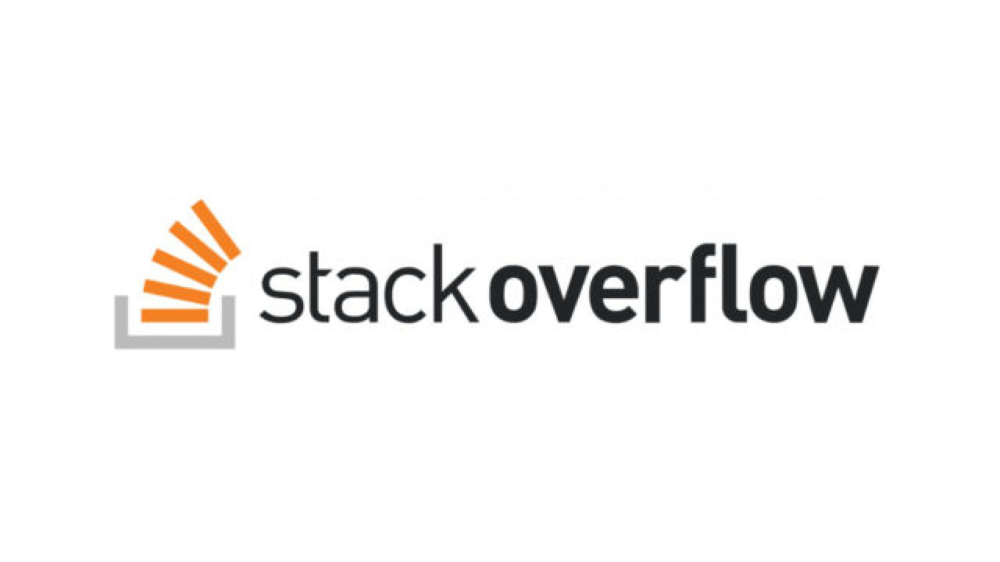
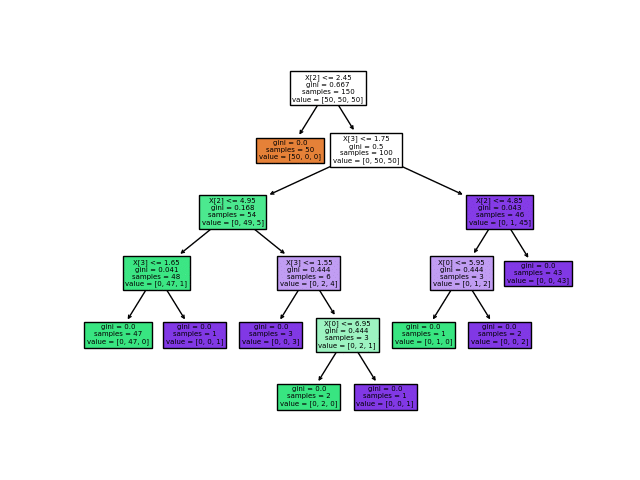

# Projet de prédiction de labels stackoverflow.

Dans ce projet nous avons dans un premier temps récupérer plusieurs centaines de posts provenant du forum stackoverflow grâce à l'API de stackexchange. Nous avons communiquer avec l'API en utilisant un script javascript.
Dans un deuxième temps nous avons dû nettoyer la donnée. C'est à dire, enlever la ponctuation inutile, les mots inutile (mots liant, certains verbe qui ne permettent pas de prédire le sujet du commentaire.)

Nous avons ensuite créer un dictionnaire de mots (bag of word). Ensuite nous avons tokenizer les mots (pour que chaque mot possède une clé correspondante).

Pour réaliser un random Forest, nous avons fait le TF-IDF qui consiste à travailler avec la fréquence des mots qui reviennent le plus souvent pour un label défini.
Malhereusement, pour le random forest, nous ne pouvons prédire qu'un seul label à la fois. Nous avons donc choisi d'essayer de prédire pour chaque commentaire un seul label.
Il reste une possibilité de prédire plusieurs labels, mais cela fait augmenter exponentiellement le nombre de classe différentes en sortie de notre arbre de décision.

